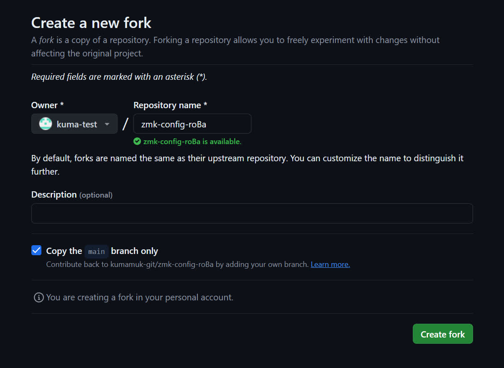
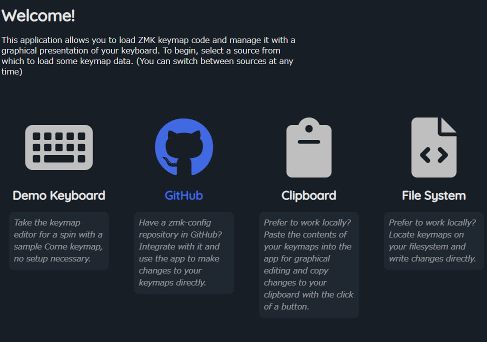
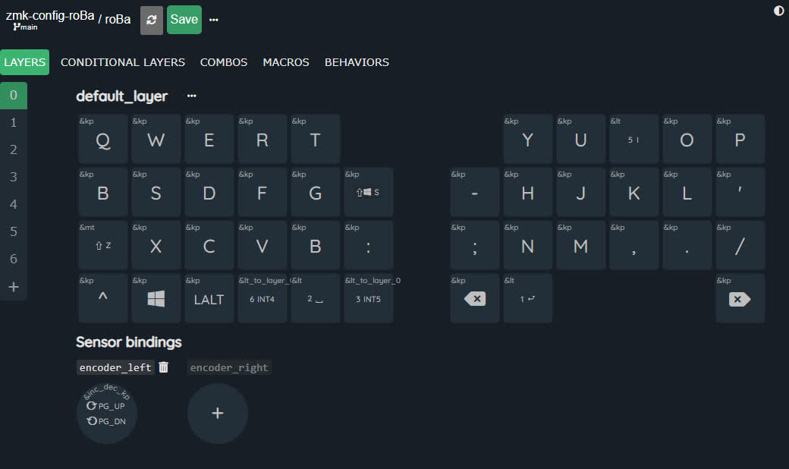

# Build Guide for roBa

## 目次
  - [1．部品確認](#1部品確認)
    - [1-1．キット内容](#1-1キット内容)
    - [1-2．別途準備が必要な部品](#1-2別途準備が必要な部品)
    - [1-3．オプション](#1-3オプション)
  - [2．準備](#2準備)
    - [2-1．必要な工具](#2-1必要な工具)
    - [2-2．ファームウェア](#2-2ファームウェア)
  - [3．実装](#3実装)
    - [3-1．ダイオードのはんだ付け](#3-1ダイオードのはんだ付け)
    - [3-2．キーソケットのはんだ付け](#3-2キーソケットのはんだ付け)
    - [3-3．スライドスイッチのはんだ付け](#3-3スライドスイッチのはんだ付け)
    - [3-4．ポゴピンのはんだ付け](#3-4ポゴピンのはんだ付け)
    - [3-5．コネクタのはんだ付け](#3-5コネクタのはんだ付け)
    - [3-6．ピンソケットのはんだ付け](#3-6ピンソケットのはんだ付け)
    - [3-7．ピンヘッダのはんだ付け](#3-7ピンヘッダのはんだ付け)
    - [3-8．L字コンスルーのはんだ付け](#3-8l字コンスルーのはんだ付け)  
    - [3-9．センサのはんだ付け](#3-9センサのはんだ付け)
    - [3-10．ロータリーエンコーダのはんだ付け](#3-10ロータリーエンコーダのはんだ付け)
  - [4．組み立て](#4組み立て)
    - [4-1．バッテリーの取り付け](#4-1バッテリーの取り付け)
    - [4-2．ケースとトッププレートの取り付け](#4-2ケースとトッププレートの組み立て)
    - [4-3．ボトムプレートの取り付け](#4-3ボトムプレートの組み立て)
    - [4-4．トラックボール読み取り基板差し込み](#4-4トラックボール読み取り基板差し込み)
    - [4-5．トラックボールケース装着](#4-5トラックボールケース装着)  
  - [5．ファームウェア書込み](#5ファームウェアの書込み)
    - [5-1．ファームウェア(仮)のダウンロード](#5-1ファームウェア仮のダウンロード)
    - [5-2．ファームウェア(仮)の書込み](#5-2ファームウェア仮の書込み)
    - [5-3．動作確認](#5-3動作確認)
  - [6．キーマップの編集](#6キーマップの編集)
  - [7．トラブルシューティング](#7トラブルシューティング)
  

## 1．部品確認

  

### 1-1．キット内容
| 名前 | 数 | 備考 |
|:-|---:|:-|
| メイン基板(左右)              | 1組 | |
| トッププレート(左右)          | 1組 |メインと親指部のセット 3Dプリント品 |
| ボトムプレート(左右)          | 1組 | 3Dプリント品|
| ケース(左右)                  | 1組 | 3Dプリント品|
| リセットボタン用スティック    | 2本 | 3Dプリント品|
| トラックボールケース          | 1個 | 3Dプリント品|
| Φ2 セラミックボール          | 1個 | 予備用 |
| 水平ロータリーエンコーダ      | 1個 | EVQWGD001|
| ロータリーエンコーダ用基板    | 1個 | |
| トラックボール読取り基板      | 1枚 | |
| トラックボール読取りセンサ    | 1個 | PMW3610|
| 読取りセンサ用レンズ          | 1個 | |
| L字コンスルーピン(7ピン)      | 1個 | |
| コンスルーピン(3ピン)         | 2個 |うち1つは中央のピンが不必要のため取り外しています |
| ピンソケット(7ピン)           | 4本 | |
| ピンヘッダ(7ピン)             | 4本 | |
| スプリングピン(ポゴピン)      | 8本 | GB15-07020-0818-2A|
| PHコネクタ                    | 2個 | |
| スライドスイッチ              | 2個 | |
| ダイオード（表面実装タイプ）  | 50個 | 予備含む|
| Kailh PCBソケット CherryMX用  | 40個 ||
| Kailh PCBソケット choc用      | 5個 | |
| スペーサー M2 7mm             | 13本 | |
| スペーサー M2 4mm             | 3本 | |
| ネジ M2 3.5mm                 | 13本 | |
| ネジ M1.7                     | 2本 | |
| クッションゴム                | 4個 | |

  

### 1-2．別途準備が必要な部品

| 名前                          | 数    | 備考 |参考情報|
|:-|-:|:-|:-|
| Xiao nrf52840                 | 2個   |  |[主な購入先](https://akizukidenshi.com/catalog/g/g117341/)|
| CherryMX互換キースイッチ      | 37個  |  親指部分をロープロ仕様にしない場合は5個追加で必要|
| ロープロファイルキースイッチ  | 5個   |  親指部分をロープロ仕様にする場合に必要|
| 直径34mmトラックボール        | 1個   |  |[主な購入先](https://www.amazon.co.jp/%E3%81%BA%E3%83%AA%E3%83%83%E3%82%AF%E3%82%B9-PERIPRO-303WH-%E4%BA%A4%E6%8F%9B%E7%94%A8%E3%83%88%E3%83%A9%E3%83%83%E3%82%AF%E3%83%9C%E3%83%BC%E3%83%AB%E3%83%91%E3%83%BC%E3%83%AB%E3%83%9B%E3%83%AF%E3%82%A4%E3%83%88Perixx-PM-517-%E4%BA%A4%E6%8F%9B%E7%94%A8%E3%83%9C%E3%83%BC%E3%83%AB%E4%BA%92%E6%8F%9B%E6%80%A7%E6%9C%89%E3%82%8A%E5%85%89%E6%B2%A2%E4%BB%95%E4%B8%8A%E3%81%92%E3%82%B9%E3%83%94%E3%83%BC%E3%83%89%E5%9E%8B/dp/B0D4F4HMXD/ref=sr_1_7?dib=eyJ2IjoiMSJ9.0RCXO5ib2-AFCi9uTFyZmltVMcNilIHzCawZL9iwAscZOGSYMMhlpg6oEuoB43-tN4d__DHxpRXRdC7EYDVmsXuC_ysLRkw1FIOY3h9qgXOXcu9_ySr5lftnZ2yp01oNdi_yFdaGp5v6tEeEcrsUkBgTj2mB6B9NDvSx5r-We7EYeQ8x4ySdJF384bEiP0F-rYpAsTBLsx_KQM9FIdhCwCo4RqZr3ohDIEBXcaRVwHVaTZ1xFQD63YsHDXRRg8KCnRVzl0iuqKmS8_5_ux2VuXOjZ9z96fgN6Q_6t59IZf8.cRtt7oACdluyAKPRQDVTcrW1F0GZI9ckfuRRN-3FcMI&dib_tag=se&keywords=%E3%81%BA%E3%83%AA%E3%83%83%E3%82%AF%E3%82%B9&qid=1723728036&sr=8-7)|
| 5mm幅カプトンテープ           | 数cm  | 近接したポゴピンの保護に使用しますので**必ず**用意してください |[主な購入先](https://www.amazon.co.jp/gp/product/B0983F8L41/ref=ppx_yo_dt_b_asin_title_o00_s00?ie=UTF8&psc=1)|
| Lipoバッテリー(コネクタ付き)  | 2個   | ボトムプレートは60mm × 35mm × 6mm 以内の大きさに対応 |[主な購入先](https://www.amazon.co.jp/gp/product/B09DPNZM31/ref=ppx_yo_dt_b_asin_title_o01_s00?ie=UTF8&th=1)|
| USB type-Cケーブル            | 1本   | ファームウェア書込みと充電に必要 |
| キーキャップ                  | 37個  | 1u 37個 親指部分をロープロ仕様にしない場合は5個追加で必要|
| ロープロファイルキーキャップ  | 5個   | 1u ５個 親指部分をロープロ仕様にする場合に必要|
| 両面テープ                    | -     | ボトムプレートへのバッテリーの固定に必要|

※リポバッテリーには発火等の危険性があります。各自購入したバッテリーの注意事項をよく読み、適切に取り扱うよう注意してください。  
　取り扱いの不備により発生した事故等の責任は負いかねます。  
※主な購入先のリンクはアフェリエイトリンクではありません。

  

### 1-3．オプション
+ 付属するロータリーエンコーダの位置はEC11互換のロータリーエンコーダをはんだ付けすることも可能です。  
その場合、一部ファームウェアの編集が必要になります。  
また、同じ位置にキーソケットを取り付けキースイッチを取り付けることも可能です。
+ ボトムプレートに直径4cmの円形のスペースを空けています。ステンレスプレートなどを仕込むことが可能です。

  

## 2．準備
  

### 2-1．必要な工具
| 名前 | 備考 |
|:-|:-|
| はんだごて  |  |
| はんだ      |  |
| ピンセット  | |
| ドライバ    ||
| マスキングテープ|あると楽|
| テスター||
| ペンチ||
  

### 2-2．ファームウェア
Xiao nrf52840へファームウェアの書込みが必要です。  
ビルド済みのファームウェアは[こちら]()です。  
zmk firmwareを使用しているため、ご自身でファームウェアやキーマップをカスタムされる場合はgithubアカウントが必要になります。  

  

## 3．実装

  

### 3-1．ダイオードのはんだ付け
ダイオードは基板裏面（roBaロゴがない面）に実装します。ダイオードは実装の向きがあります。  
ダイオードに薄く書かれている線と基板に印刷された図（以降シルク）にある線が同じ方向になるように取り付けて下さい。  
+ ロータリーエンコーダ実装箇所1箇所のダイオードのみ向きが左右反対になっています。気を付けてください。(すみません、、)  

<!--
写真  (ロータリーエンコーダ取り付け部分のダイオードの向き)
-->

ダイオード用パッドの片側にはんだを盛ります。  
そしてピンセットでダイオードを掴み、シルクと向きを合わせて事前に盛ったはんだを溶かしつつ位置を合わせます。  
およそシルクと同じ位置に決まったら、もう片側もはんだで固定します。  
ピンセットでダイオードが取れないことを確認したら取り付け完了です。  
これをすべて(43箇所)に対して行います。

  

### 3-2．キーソケットのはんだ付け  
キーソケットも基板裏面に実装します。  
親指部分はchoc用のキーソケットを使用可能です。  
ダイオードと同様に片方のパッドに事前にはんだを盛ります。  
そして、キーソケットをシルクに合う向きで基板にはめ込みます。  
その状態のまま、キーソケットをピンセットで抑えつつ、事前に盛ったはんだを溶かすとキーソケットが沈み、固定できます。  
固定出来たら、反対側のパッドもはんだで固定します。  
+ ロータリーエンコーダ不要の方向けにロータリーエンコーダ実装箇所にもキーを取り付けられるようにしています。  
ロータリーエンコーダを実装する場合はこの部分へのキーソケットの取り付けは不要です。  

<!--
写真  (ロータリーエンコーダ取り付け部分のソケット)
-->

  

### 3-3．スライドスイッチのはんだ付け  
このスライドスイッチが電源スイッチとなります。  
スライドスイッチは基板表面に実装します。  
表面からピンを差し込み、マスキングで仮止めします。  
そして裏面から出たピンをはんだ付けし、固定します。  
はんだ付け後、ピンが長い場合はペンチ等で短くカットしても良いかもしれません。  

  

### 3-4．ポゴピンのはんだ付け  
ポゴピンって名称がいいですよね。口に出して言いたい単語です。  
名称のわりにポゴピンのはんだ付けが一番難易度高いかもしれません。  
ポゴピンは基板表面に実装します。  
実装部分に差し込み、ポゴピンの根本をはんだで固定します。  
この時ポゴピンが斜めになり、隣のポゴピンに接触しないように注意してください。  
テスタなどで隣接したポゴピンが導通していないかを必ず確認してください。  
確認出来たら念のため、カプトンテープで保護し、取付完了です。
左右各4箇所、合わせて計8箇所あります。

  

### 3-5．コネクタのはんだ付け  

バッテリ取り付け用のコネクタです。  
コネクタは基板表面に実装します。  
表面からシルクに合うような向きで差し込み、マスキングテープで仮止めします。  
そして、裏面からはんだで固定します。 
左右各1箇所、計2箇所取り付けます。

  

### 3-6．ピンソケットのはんだ付け  

マイコン取り付け用のソケットです。  
基板表面に実装します。  
表面から差し込み、マスキングテープで仮止めします。  
そして、裏面からはんだで固定します。  
左右各2箇所、計4箇所取り付けます。  

  

### 3-7．ピンヘッダのはんだ付け  

ピンヘッダはマイコンにはんだで取り付けます。  
まず、先ほど取り付けたソケットにそれぞれピンヘッダを差し込みます。  
その状態でマイコンにピンヘッダを差し込みます。  
しっかりと奥まで差し込まれた状態(ポゴピンの先が押し込まれ、マイコンのパッドに接触している状態)で、マイコンにピンヘッダをはんだ付けします。

  

### 3-8．L字コンスルーのはんだ付け  

トラックボール読み取り基板を取り付けるためのコンスルーです。  
コンスルーには輪っかになっているピンと1本の直線のピンがありますが、直線のピンのほうを基板へ取り付けます。  
コンスルーは基板表面に実装します。  
表面から差し込み、マスキングテープで仮止めします。
そして、裏面からはんだで固定します。  
トラックボール取り付け側の基板のみ1箇所です。  

  

### 3-9．センサのはんだ付け  

トラックボール読み取り基板へセンサをはんだ付けします。  
「pmw3610 module」の文字がある面を表面とし、裏面からセンサを差し込みます。  
このとき、向きを間違えないよう写真をよく確認してください。  
裏面に書かれた文字とセンサに書かれた文字の上下が揃っている向きが正しい向きです。 

<!--
写真(センサ取り付け向き)
-->

そして、表面に出たセンサのピンをすべてはんだ付けしていきます。  

+ ランドの面積が小さいので、はんだを盛りすぎてピンがブリッジしてしまわないように注意してください。  

+ また、はんだ不良によりセンサが動作しない場合もありますので、  
センサが動作しない場合は、まず、この部分のはんだに不良がないか確認するとよいです。  

センサの取り付けが完了したら、レンズを装着してください。 

<!--
写真(センサ取り付け向き)
-->

  

### 3-10．ロータリーエンコーダのはんだ付け

このロータリーエンコーダはメイン基板に直接実装すると少し背が低いので、一枚基板を挟んで取り付けます。

まず、メイン基板へコンスルーを差し込みます。  
コンスルーの反対側のピンにロータリーエンコーダ用基板を差し込みます。  
ロータリーエンコーダ用基板の上部から出ている側のピンをはんだで固定します。  
はんだ後、上部にはみ出たピンはロータリーエンコーダの取り付けの邪魔になるためペンチで短くカットします。  
+ メイン基板の裏に出ているピンははんだしないことでロータリーエンコーダを後から外し、キースイッチに取り換えることができます。

ロータリーエンコーダ用基板はメイン基板から一度取り外します。  
写真のように基板にロータリーエンコーダを差し込みます。
裏面から出たピンをはんだで固定します。  

ロータリーエンコーダの取り付けが完了したら、メイン基板へ差し込みます。  

以上ですべてのはんだ付けが終了です。腰が丸まったと思うので背伸びしておいてください。お疲れ様でした。

なお、この時点で、[手順4-4](#4-4トラックボール読み取り基板差し込み)、[手順5](#5ファームウェアの書込み)あたりを行い、動作確認をしてしまうと組み立て後の後戻りが少なく楽かもしれません。

  

## 4．組み立て

  

### 4-1．バッテリーの取り付け

バッテリー用コネクタにバッテリーを差し込みます。  
基板の切り欠きから配線を裏に通すようにします。
購入したバッテリと極性が合っているかを確認し取り付けてください。

<!--
写真(バッテリコネクタ極性)
-->

  

### 4-2．ケースとトッププレートの取り付け

メイン基板の上にケースを乗せます。  
この時、ケースのマイコン上部にある穴にリセットボタン用スティックを差し込みます。  
このスティックを介してマイコンのリセットボタンを押せるようにしています。  
<!--
写真(リセットボタン用スティックの取り付け)
-->

さらに、ケースの上からトッププレートを乗せます。  
トッププレートとメイン基板で挟み込みケースを固定する構造になっています。  
トッププレートとメイン基板の間は空洞になってしまいますが、お好みでポロンシートなど仕込むと打鍵音にいい影響があるかもしれません。 

メイン基板の裏側からスペーサを差し込み、トッププレート側からM2ネジで固定します。  
親指ロープロ仕様の場合は写真の3箇所に4mmスペーサを使用します。他は7mmスペーサを使用します。

<!--
写真(4mmスペーサ取り付け位置)
-->

  

### 4-3．ボトムプレートの取り付け

ボトムプレートのくぼみにバッテリーを収納します。  
この時バッテリーの裏に両面テープを貼り、ケースへ固定することをお勧めします。  
また、小さいサイズのバッテリーを使用し、スペースが余る場合はポロンシートなどで隙間を埋めておくと良いかもしれません。 
さらに、打鍵音を気にする方は、メイン基板の裏にマスキングテープを張っておくと打鍵音が多少良くなります。

バッテリーを収納することができたら、ケース裏にボトムプレートをはめ込みます。  
そして、裏からM2ネジで固定します。

  

### 4-4．トラックボール読み取り基板差し込み

メイン基板のL字コンスルーにトラックボール読み取り基板を差し込みます。  

### 4-5．トラックボールケース装着

トラックボール読み取り基基板を取り付け後、トラックボールケースを上から差し込み、ボトムプレート裏からM1.7ネジで固定します。

以上で組み立て完了です。お疲れ様でした。

## 5．ファームウェアの書込み

### 5-1．ファームウェア(仮)のダウンロード

(仮)としているのは、いずれキーマップをカスタマイズする際に現状ファームウェア自体を変更し、書込み直す必要があるためです。  
（zmk studioというプロジェクトが進んでいて、いずれファームウェアの変更なしにキーマップのみGUIで編集できるようになるらしいです。やったね。）

[こちら]()からzipファイルをダウンロードしてください。  

解凍すると以下の3つの.uf2ファイルが入っています。  
+ settings_reset-seeeduino_xiao_ble-zmk.uf2
+ roBa_L-seeeduino_xiao_ble-zmk.uf2
+ roBa_R-seeeduino_xiao_ble-zmk.uf2

### 5-2．ファームウェア(仮)の書込み
settings_reset-seeeduino_xiao_ble-zmk.uf2は[ここ](https://zmk.dev/docs/troubleshooting/connection-issues#split-keyboard-halves-unable-to-pair)にあるように分割キーボードのペアリングに関する問題を解決するための設定初期化用のファームウェアです。

1. PCと左側のマイコンをUSBで接続します。はじめはキーボードの電源はオフで大丈夫です。
2. マイコンのリセットボタンを2回押すと、「XIAO SENSE」という名前でUSBドライブとして認識されるかと思います。(ブートローダの起動)
3. 「XIAO SENSE」ドライブにsettings_reset-seeeduino_xiao_ble-zmk.uf2をドラッグアンドドロップします。  
4. 書込み完了すると、「XIAO SENSE」というドライブは消えますが、再度セットボタンを2回押し、ブートローダを起動します。  
5. 「XIAO SENSE」ドライブにroBa_L-seeeduino_xiao_ble-zmk.uf2をドラッグアンドドロップします。  
6. 右側も同様の手順でsettings_reset-seeeduino_xiao_ble-zmk.uf2とroBa_R-seeeduino_xiao_ble-zmk.uf2を順番に書き込みます。
7. 両方の書込みが完了したら、電源を入れ、それぞれのマイコンのリセットボタンを**1回**押します。
8. PCでbluetoothデバイスとして「roBa」が認識され接続できればOKです。  

### 5-3．動作確認

bluetooth接続が完了したらすべてのキーが認識するか、ロータリーエンコーダ、トラックボールが問題なく動作するか確認しましょう。  
左右間のペアリングは電源を入れると自動的に行われます。  
有線接続でも動作しますが、左右間は無線接続のみになります。  
ファームウェア(仮) では以下のような接続方式になっているのでロータリーエンコーダ側はPCに有線接続してもキーボードとして動作しません。  
+ ロータリーエンコーダ側(ペリフェラル) ⇔ (無線接続) ⇔ トラックボール側(セントラル) ⇔ (無線or有線接続) ⇔ PC

## 6．キーマップの編集

冒頭で書いたようにzmk firmwareの編集にはgithubのアカウントが必要です。  
一からファームウェアを用意する際の手順は[公式ドキュメントの導入解説](https://zmk.dev/docs/user-setup)を見るとわかりやすいです。  
以下では、私が作成したリポジトリをフォークし、[KeymapEditor](https://nickcoutsos.github.io/keymap-editor/)を用いてGUIでキーマップを書き換える手順を紹介します。  

1. githubアカウントを作成し、ログインします。
2. [このリポジトリ](https://github.com/kumamuk-git/zmk-config-roBa)にアクセス
3. 画面右上の「Fork」をクリック

4. そのまま「Create fork」をクリック

5. フォークしたリポジトリの「Actions」タブに移動し、「I understand my workflows, go ahead and enable them」をクリックし、github Actionsを有効化

6. [KeymapEditor](https://nickcoutsos.github.io/keymap-editor/)にアクセス  
7. 「GitHub」を選択
  
8. 「Login with GitHub」からでログインし、「Authorize Keymap Editor」を選択  
9. 指示に従い、フォークしたzmk-config-roBaにKeymap Editorがアクセスできるように進める
10. Keymap Editor上でキーマップが表示されたら、好きにキーマップを編集する
11. 画面左上の「Save」を押すと、編集したキーマップが適用されてGitHub Actionsが走り、自動的にビルドが開始します

12. 「Save」の隣に表示される「Latest」をクリックするとGitHubに移動し、ビルドが完了するとファームウェアがダウンロードできるようになります。  
（ビルドには2～4分かかる場合があります。）
13. [書込み手順](#5-2ファームウェア仮の書込み)に従い、ファームウェアを書き込みます。  
    + キーマップの編集のみの場合はトラックボール側(セントラル)のみを書き換えることで変更が適用されます。  
    リセットファームウェアの書込みも基本的には必要ありません。
    + KeymapEditorを用いずにroBa.keymap以外のファイルの内容を書き換えた場合は、左右のファームウェアを書き換えてください。  
14. 無事に変更したキーマップが適用されていれば成功です。

***※REMAPやVialには対応していません。***

## 7．トラブルシューティング

### bluetoothデバイスとして認識されない or 認識しても接続できない or 接続できたが片側が反応しない
+ [zmk firmware公式のトラブルシューティング](https://zmk.dev/docs/troubleshooting/connection-issues#split-keyboard-halves-unable-to-pair)にあるようにまずはsettings_reset-seeeduino_xiao_ble-zmk.uf2の書込みからやり直すことをお勧めします。  
+ （あまりないと思いますが）マイコン自体に問題がないか確認するため、キーボードに接続しない状態マイコン2個で認識、接続できるかも一応試してみてください。  
### トラックボールが動かない  
+ （あまりないと思いますが）ケースが正しく装着できておらずセンサの読み取り部分が隠れてしまっていないか確認してください。
+ トラックボール読み取り基板とセンサのはんだに不良がないか確認してください。  
  + はんだに失敗しやり直し不可の場合は、センサとトラックボール読み取り基板のみで保守部品としてboothで販売予定ですのでそちらをご利用ください。  
+ settings_reset-seeeduino_xiao_ble-zmk.uf2の書込みからやり直してみることが有効な場合があります。  

### 一部キーが反応しない  
+ ソケットのはんだ不良、ダイオードの向き、キースイッチが正しくソケットに刺さっているかを確認してください。  

### zmk firmwareについて
このキーボード固有の問題ではなくファームウェアのカスタマイズ等で疑問点がある場合、以下が参考になると思います。  
+ [公式ドキュメント](https://zmk.dev/)
  + かなり丁寧に作りこまれているので基本的な設定はドキュメント見ればわかると思います。
+ [zmk firmware Discordサーバ](https://zmk.dev/community/discord/invite)  
  + 活発に動いているので質問すると誰かしら回答くれることが多いです。